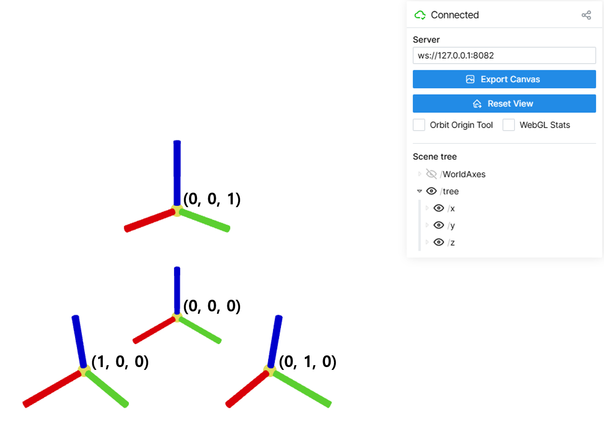

# viser 기반 3D 시각화 모듈

viser 라이브러리를 사용하여 PySide6 기반의 3D 공간 시각화 UI를 구성 모듈  

시각화된 공간은 **왼손 좌표계(left-handed coordinate system)**를 따르며, X, Y, Z 축이 각각 빨강, 초록, 파랑 색상으로 표현됩니다.

## viser

UC Berkeley에서 작성, 배포된 3차원 공간 표현 모듈 공개된 -> [github 레포지토리](https://github.com/nerfstudio-project/viser)

주요 특징은 다음과 같음음

- 웹 서버 기반 3D 공간 렌더링: viser 서버를 실행하여 3D 시각화 제공

- 좌표축 및 객체 표현: **왼손 좌표계(left-handed coordinate system)** (X축: 빨강 Y축: 초록 Z축: 파랑)

- 시각화된 데이터는 tree 구조로 저장되어 각각 구분하여 시각화 옵션을 적용 가능함

- 자체적인 UI 구성이 가능함.

## PySide6와 연동

PySide6에서 3차원 공간 시각화를 위한 모듈로 QThread를 이용하여 즉각적인 반응이 가능하도록 구성
