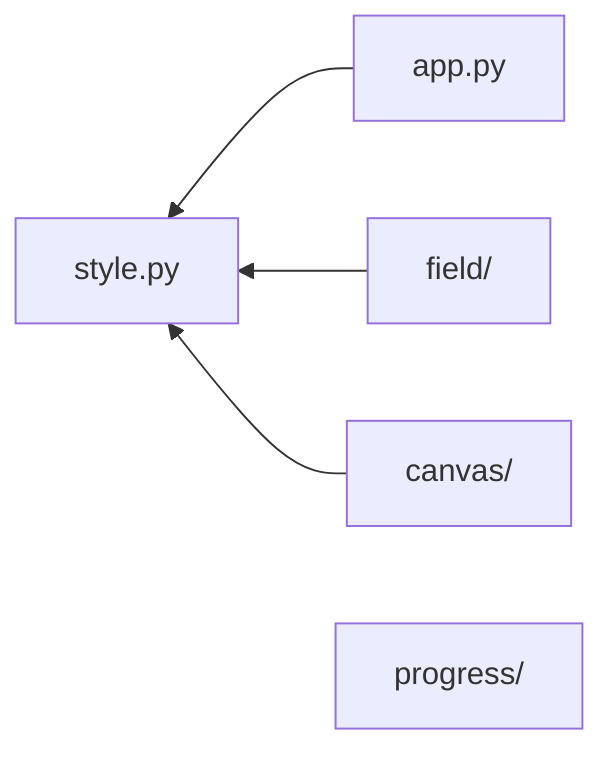

# ui_toolbox - Qt 부품

도메인 0. 무엇을 담는 값인지 안 묻는 위젯과 그 계약.

경계는 이 문서, 인자·반환은 심볼의 docstring, 미완 항목은 [`TODO.md`](TODO.md).

---

## 구조



| 주제 | 아는 것 | 모르는 것 | src |
|---|---|---|---|
| 수명 | 앱을 세우고 창 하나에 본문 하나를 앉힘 | 무엇을 띄우는가 | [`app.py`](ui_toolbox/app.py) |
| 꾸밈 | 토큰 -> 팔레트 · 시트, 위젯이 다는 역할 이름 | 어느 위젯이 무엇인가 | [`style.py`](ui_toolbox/style.py) |
| 칸 | 이름 붙은 칸과 그 값들 | 값이 무엇을 뜻하는가 | [`field/`](ui_toolbox/field) |
| 화면 | 포인터를 도메인 좌표로 냄 | 좌표의 뜻, 무엇이 그려지는가 | [`canvas/`](ui_toolbox/canvas) |
| 일 | 도는 일의 진행과 끝 | 일의 정체 | [`progress/`](ui_toolbox/progress) |

- 주제끼리 안 봄. 아래로 향하는 것은 `style` 하나
- 폴더 주제 안은 세 층 - 선언(`_*.py`) <- `form/widget/` <- `form/layout/`
- 표현이 늘어도 선언은 안 바뀜. 없는 층은 폴더를 안 만듦
- 순환이 나면 그 자리는 등록표로 뒤집음 - 위가 아래에 자기를 등록
- test 없음. 어느 주제도 아직 안 붙듦

```bash
cd ui_toolbox
grep -rnE "^from \.+(field|canvas|progress)" --include=*.py field canvas progress
grep -rnE "^(from|import) [a-z_]+_toolbox" --include=*.py .
```

## 기반

| 무엇 | 갈래 | 쓰는 자리 |
|---|---|---|
| [`Canvas`](ui_toolbox/canvas/_canvas.py) | 계약 - 포인터 신호 넷 · 배율 · `set_interactive` | `Raster_canvas` |
| [`Task`](ui_toolbox/progress/_task.py) | 계약 - `run` 하나, 진행과 끝은 신호로 | `Call_task` |
| [`Value`](ui_toolbox/field/_value.py) | 계약 - `value` · `set_value` | 없음 (부채) |
| [`Pop_dialog`](ui_toolbox/field/form/widget/_dialog.py) | 골격 - 제목 · 본문 · 하단 버튼바 | `Search_picker` |
| [`Stack_view`](ui_toolbox/field/form/layout/_stack.py) | 골격 - 행마다 위젯 한 줄, 덧붙는 칸은 `_extras` | `Pair_editor` |
| [`Field`](ui_toolbox/field/_field.py) · `Rows` | 선언 - 칸과 행. Qt 를 모름 | `Table_view` · `Stack_view` · `Config_form` |
| [`Mark`](ui_toolbox/style.py) 의 역할 이름 | 표시 - 위젯이 달고 QSS 가 받음 | 색 · 폭이 붙는 위젯 전부 |

- 계약은 상속으로 섬. `Value` 만 상속하는 것이 없어 문서에만 있음
- 골격은 그리는 자리를 비워 두고 서브클래스가 채움

## 워크플로

| 타깃 | 담는 것 | 더 무는 것 |
|---|---|---|
| `app` · `style` | 앱 수명, 팔레트 · 시트 | PySide6 |
| `field` | 칸 선언, 표 · 스택 · 폼 · 값 위젯 | - |
| `progress` | 스레드 하나와 막대 | - |
| `canvas` | 라스터 뷰 | numpy · cv2 |

- 최상단 `__init__` 이 이름을 안 올림 -> import 한 타깃만 무는 것이 늚
- 3D 가 오면 `canvas` 에 `open3d` 하나 늚
- 실행 진입은 `app.Run` 하나. 팔레트 · 시트가 거기서 서므로, 안 쓰면 창에
  `Sheet` · `Palette` 를 손으로 걺 - 위젯은 토큰을 안 읽음
- 빌드는 [`pyproject.toml`](pyproject.toml) 하나. 무는 것을 갈래로 안 가름 -
  세 개뿐이라 나눌 값이 없음

```bash
pip install git+https://github.com/DXR-keonghun6612/ToolBox.git@HUB#subdirectory=ui_toolbox
```
