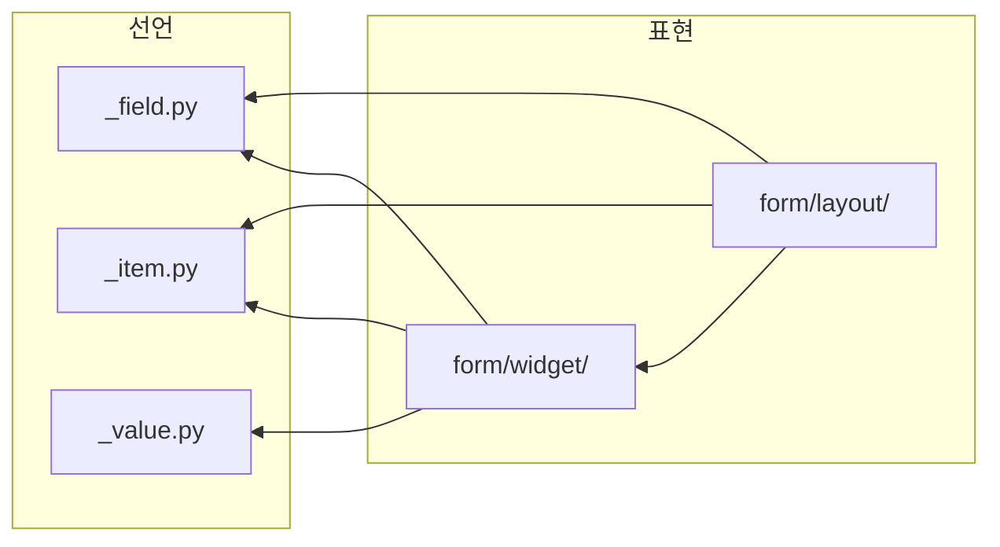

# field - 이름 붙은 칸과 그 값들

칸 하나가 이름 · 자료형 · 표시 · 입력 힌트를 함께 듦. 같은 선언이 행 하나면 폼, 여럿이면 표 · 스택.

## 구조



| 자리 | 아는 것 | 모르는 것 |
|---|---|---|
| [`_field.py`](_field.py) | `Field` · `Rows` - 칸 선언과 행들의 값 · 순서 · 거르기, `Field.type` 판별 | Qt, 무엇으로 보이는가 |
| [`_item.py`](_item.py) | `Button` - 글리프 · 툴팁 · 눌렸을 때 낼 값 | 어디에 붙는가 |
| [`_value.py`](_value.py) | `Value` - `value` · `set_value` · `edited` | 어느 위젯이 서는가 |
| [`form/widget/`](form/widget) | 단일 위젯과 `칸 선언 -> 위젯` 등록표 | 여럿이 어떻게 놓이나 |
| [`form/layout/_form.py`](form/layout/_form.py) | `Config_form` - 칸 선언 목록을 세로로. 신호 하나로 묶음 | 어느 위젯이 서나 |
| [`form/layout/_stack.py`](form/layout/_stack.py) | `Stack_view` - 행마다 위젯 한 줄. 머리줄 · 이동 · 제거 | 행이 몇이 될지 |
| [`form/layout/_pair.py`](form/layout/_pair.py) | `Pair_editor` - key/value 쌍 목록. 중복 key 와 순서를 허용 | 쌍이 무엇을 뜻하나 |

- 선언 셋은 서로도 안 봄. 한 사슬이 아니라 나란한 셋
- 배치가 위젯을 안 고름. `Config_form` 도 `Stack_view._cell` 도 등록표를 찾기만 함 -
  자료형이 늘 때 고치는 자리가 한 곳
- 같은 칸 선언이 세로 폼에서는 라벨을 달고 스택에서는 안 담. 머리줄이 이름을 이미 들어서
- 행 여럿을 미는 셋(`Table_view` · `Stack_view` · `Pair_editor`)도 `Value` 계약.
  payload 가 `list[dict]` 일 뿐. 칸이 고정이면 `Table_view`, 상황따라 숨으면 `Stack_view`
- `Pair_editor` 만 배치 층에서 자기를 등록표에 올림. 위젯 층이 배치를 못 보므로
- `__init__.py` 는 이름만 올림

```bash
grep -rnE "^from \.+(form|layout)" _field.py _item.py _value.py
```
