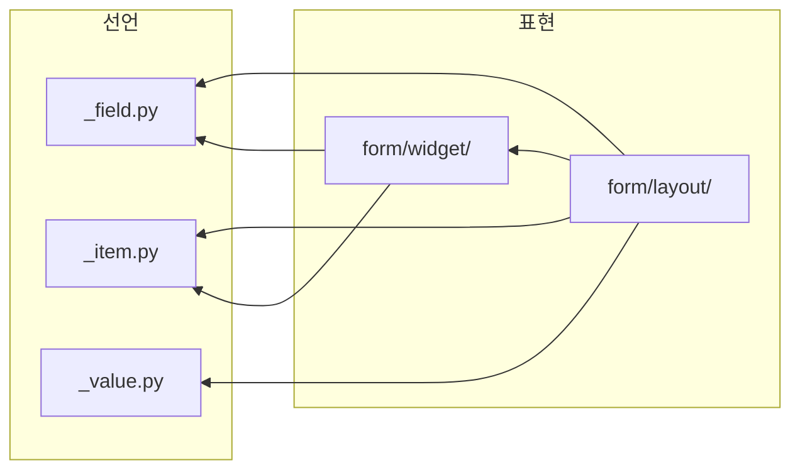

# field - 이름 붙은 칸과 그 값들

칸 하나가 이름 · 자료형 · 표시 · 입력 힌트를 함께 듦. 같은 선언이 행 하나면 폼, 여럿이면 표 · 스택.

## 구조



| 자리 | 아는 것 | 모르는 것 |
|---|---|---|
| [`_field.py`](_field.py) | `Field` · `Rows` - 칸 선언과 행들의 값 · 순서 · 거르기 | Qt, 무엇으로 보이는가 |
| [`_item.py`](_item.py) | `Button` - 글리프 · 툴팁 · 눌렸을 때 낼 값 | 어디에 붙는가 |
| [`_value.py`](_value.py) | `Value` 계약과 자료형 판별 | 어느 위젯이 서는가 |
| [`form/widget/_bar.py`](form/widget/_bar.py) | `Button_bar` - 버튼 선언을 한 줄로, 눌린 값을 냄 | 그 값이 무엇을 뜻하는가 |
| [`form/widget/_int.py`](form/widget/_int.py) | `Int_slider_row` - 정수 하나. 슬라이더와 스핀이 맞물림 | 어느 칸의 값인가 |
| [`form/widget/_float.py`](form/widget/_float.py) | `Float_slider_row` - 실수 하나. 단위를 step 으로 잘라 씀 | 어느 칸의 값인가 |
| [`form/widget/_snap.py`](form/widget/_snap.py) | `Snap_slider_row` - 기준값에 달라붙는 좁은 슬라이더 | 왜 그 값이 기준인가 |
| [`form/widget/_path.py`](form/widget/_path.py) | `Path_row` - 경로 한 줄 + 탐색 버튼 | 그 경로에 무엇이 있나 |
| [`form/widget/_dialog.py`](form/widget/_dialog.py) | `Pop_dialog` - 제목 · 본문 · 버튼바 골격 | 본문이 무엇인가 |
| [`form/widget/_search.py`](form/widget/_search.py) | `Search_picker` - 후보를 걸러 하나 고름 | 후보가 어디서 왔나 |
| [`form/widget/_table.py`](form/widget/_table.py) | `Table_view` - 행들을 모델 하나로 밈. 정렬 · 거르기는 보이는 순서만 | 칸의 뜻 |
| [`form/widget/_tree.py`](form/widget/_tree.py) | `QTreeWidget` 컬럼 · 헤더 기본값 | 무엇을 담나 |
| [`form/layout/_form.py`](form/layout/_form.py) | `Config_form` - 칸 선언 목록을 자료형별 위젯으로 지음 | 그 파라미터가 무엇에 쓰이나 |
| [`form/layout/_stack.py`](form/layout/_stack.py) | `Stack_view` - 행마다 위젯 한 줄을 만들어 세로로 쌓음 | 행이 몇이 될지 |
| [`form/layout/_pair.py`](form/layout/_pair.py) | `Pair_editor` - key/value 쌍 목록. 중복 key 와 순서를 허용 | 쌍이 무엇을 뜻하나 |
| [`form/layout/_group.py`](form/layout/_group.py) | `Collapsible` - 헤더로 본문을 접고 그 자리를 형제에 넘김 | 본문이 무엇인가 |

- 선언 셋은 서로도 안 봄. 한 사슬이 아니라 나란한 셋
- 칸이 고정된 목록은 `_table`, 상황따라 숨거나 폼이 통째로 드는 항목은 `_stack`.
  둘이 같은 표면(`changed` · `rows` · `load`)을 냄
- `__init__.py` 는 이름만 올림

```bash
grep -rnE "^from \.+(form|layout)" _field.py _item.py _value.py form/widget/*.py
```
