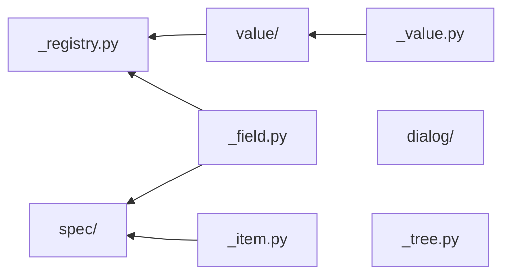

# form/widget - 단일 위젯

값 하나를 받거나 조작 단위 하나를 이룸. 여럿이 어떻게 놓이는지는 안 앎.

## 구조

폴더를 가르는 것은 어느 계약을 import 하나.



| 자리 | 아는 것 | 모르는 것 |
|---|---|---|
| [`value/`](value) | `Value` 계약. 값 하나를 받는 위젯 여덟 | 어느 칸의 값인가 |
| [`spec/`](spec) | `Field` · `Rows` · `Button` 선언. 행 여럿을 한 판으로 밈 | 칸의 뜻 |
| [`dialog/`](dialog) | `Pop_dialog` 골격과 그 상속 | 본문이 무엇인가 |
| [`_registry.py`](_registry.py) | `(자료형, kind, editable) -> 위젯`. `Field` 에서 인자를 꺼냄 | 그 값이 무엇을 뜻하나 |
| [`_tree.py`](_tree.py) | `QTreeWidget` 컬럼 · 헤더 기본값 | 무엇을 담나 |

- 폴더 셋은 서로 안 봄. 가로지르는 것은 `_registry` 하나 - 값 위젯과 선언을 함께 봄
- `spec/` 의 `Table_view` 도 `Value` - payload 가 `list[dict]` 일 뿐이라 폴더를 안 가름
- 그래서 값 위젯이 자기를 못 올림. 선언을 보는 순간 `value/` 의 경계가 무너짐
- 뿌리에 남은 `_tree` 는 함수 둘이라 계약이 안 섬
- `__init__.py` 가 이름을 모아 올림 - 소비처는 폴더를 안 앎

```bash
grep -rnE "^from \.\.\.\._(field|item)" value
grep -rnE "^from \.\.\.\._value" spec dialog
```
