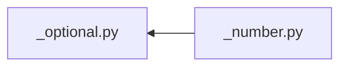

# value - 값 하나

`Value` 계약을 상속. 폼이 보는 표면 셋은 같고, 자료형 있는 `value_changed` 만 각자 소유.

## 구조

| 자리 | 아는 것 | 모르는 것 |
|---|---|---|
| [`_number.py`](_number.py) | `Int_slider_row` · `Float_slider_row` - 수 하나. 스냅 슬라이더 부품 | 그 수가 무엇을 재나 |
| [`_check.py`](_check.py) | `Check_row` - 참 · 거짓 하나 | 무엇을 켜고 끄나 |
| [`_text.py`](_text.py) | `Text_row` · `List_row` - 글자 하나, 쉼표로 가른 목록 | 그 글자가 무엇인가 |
| [`_optional.py`](_optional.py) | `Optional_float_row` - 켜고 끄는 실수. 끄면 `None` | 왜 끌 수 있어야 하나 |
| [`_path.py`](_path.py) | `Path_row` - 경로 한 줄 + 탐색 버튼. `refresh` 를 따로 냄 | 그 경로에 무엇이 있나 |
| [`_readout.py`](_readout.py) | `Readout_row` - 보여 주기만. 자료형을 안 가림 | 왜 못 고치나 |

- 표현마다 클래스를 안 세움. 스냅 · 읽기 라벨 · 폭은 `Int_slider_row` 의 인자
- 라벨은 인자. 비면 라벨 위젯을 안 만듦 - 머리줄이 이름을 이미 드는 자리에
- 값이 바뀐 것과 다시 읽어 달라는 것은 다른 사건 - `_path` 만 신호를 둘 듦
- `_text` 둘은 상속 - 골격이 같고 `value` · `set_value` 의 환산만 갈림
- 가로지르는 간선 하나 - `_optional` 이 슬라이더를 `_number` 에서 가져다 씀
